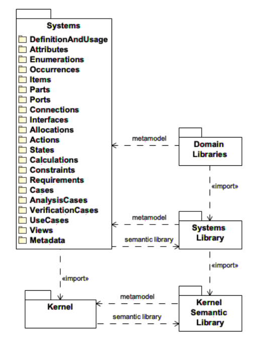

# 6 介绍

## 6.1 文档概述

系统建模语言（SysML）是一种通用的建模语言，用于对系统进行建模，
目的是推进工程系统的基于模型的系统工程（MBSE）方法。
本文档提供对SysML第二版的标准规范。
SysML v2的目的是增强语言的精确度、表达性、互操作性，以及一致性和整合性。

SysML v1是作为统一建模语言（UML）v2的一个概要而定义的。
SysML v2，则定义为一个元模型，其对KerML中的Kernel元模型进行了扩展。
为了推进从v1到v2的转换，本规范还一个形式化的转换模型，可以将使用SysML v1.7概要的模型，
转换为使用SysMLv2元模型的模型。

