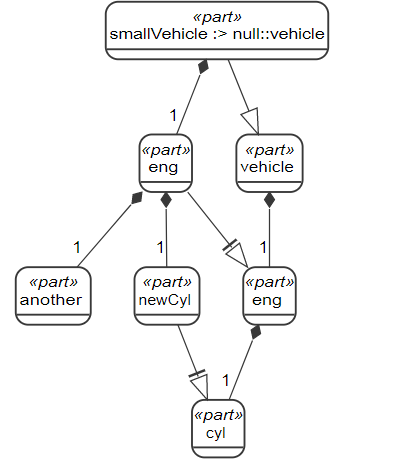

import Colored from '../../src/common/Colored/Colored'

# 语言简介

### 包 Package

```sysml
package 'Package Example' {
    import ISO::TorqueValue;
    import ScalarValues::*;

    part def Automobile;

    alias Car for Automobile;
    alias Torque for ISO::TorqueValue;
}
```

*包*的作用是作为一个其成员的命名空间，以及其所拥有成员的一个*容器*。

:::note
成员和拥有成员的区别：拥有成员表示此成员直接在此包内定义，例如上面所定义的`Automobile`，而成员可能包括从其他命名空间下引入的成员。
:::

可以使用*import*来将其他包内的某个成员或者所有成员引入到当前包内。
要引入全部成员，可以使用 _\*_，例如`import ScalarValues::*`。

在包内，可以对成员创建*别名*。别名既可以对包的拥有成员创建，也可以对引入的其他包内的成员创建。

如果包的名称中包含空格，那么需要将其用单引号包裹起来。

#### 成员可见性

```sysml
package 'Package Example' {
    public import ISO::TorqueValue;
    private import ScalarValues::**;

    private part def Automobile;

    public alias Car for Automobile;
    alias Torque for ISO::TorqueValue;
}
```

在包内，可以使用关键字*private*、_public_ 来控制成员的可见性（Visibility）。

可见性关键字可以在*import*前使用。如果使用`public import`，那么相当于将引入的成员再次导出，其相对于引用此包的命名空间，也是可见的。

私有的（_private_）成员对包的外部是不可见的，但是对于包内部的子包而言，则是可见的。

默认情况下，所有成员都是公共的（_public_）。使用 _public_ 关键字只是将此语义显示的标明出来。

### 注释 Comment

```sysml
package 'Comment Example' {
    /* 这是文档注释，是模型的一部分，
     * 默认作为包的说明文档。 */

    comment Comment11 /* 这是一个具名注释 */

    comment about Automobile
    /* 这是一个不具名的文档注释，
     * 使用about来指定说明的元素。
     */

    part def Automobile;

    /**
     * 这是一个文档注释，用来说明紧邻其下的元素。
     *
     */
    alias Car for Automobile;

    // 这是一个批注。
    // 批注以文本形式展示，但是并不是模型的一部分。
    alias Torque for ISO::TorqueValue;

}

```

*注释*用来对模型做出说明，以 _/\*_ 开始，以 _\*/_ 结束。

注释可以作为单独的元素存在，此时其可以具有一个名字。

当注释直接作为其所注释的元素的一部分时，分为几种情况：

1. 元素文档

   以 _/\*\*_ 开始，作为紧邻其下元素的一部分。

2. 不相邻元素文档

   可以使用 `comment about 指定元素` 的方式，将注释和元素放在不同的地方。此时，由于此注释不是单独的元素，所以不能具有名字。

3. 包文档

   只以 _/\*_ 开始，作为其所在包的一部分。

最后，对于模型的单纯批注，可以使用 _//_ 开头。多行批注则可以 _//\*_ 开头。批注不作为模型的一部分。

### 文档 Documentation

```sysml
package 'Documentation Example' {
    doc /* 这是所属包的文档
         */
    part def Automoble {
        doc /* 这是Automobile的文档 */
    }

    alias Car for Automobile;
    alias Torque for ISO::TorqueValue;
}
```

*文档*是一种特殊类型的注释。

### 部件和属性定义 Part/Attribute Definition

```sysml
part def Vehicle {
    attribute mass : ScalarValues::Real;

    part eng : Engine;

    ref part driver : Person;
}

attribute def VehicleStatus {
    import ScalarValues::*;

    attribute gearSetting : Integer;
    attribute acceleratorPosition : Real;
}

part def Engine;
part def Person;
```

在 SysMLv2 里，广泛使用*定义*（_definition_ ）和*使用*（_usage_）的概念，以支持重用。
*定义*表示某种建模概念的声明，而*使用*则表示定义的概念在某个上下文中的实例。

:::note
*定义*和*使用*都属于命名空间的一种，因此可以在其中使用*import*来引入其他成员。
:::

*部件定义*是系统或者系统组成的类型定义，表示在物理时空上存在并且可变的某种实体。
*部件定义*可以被作为部件或者引用部件来使用。其中，*部件使用*表示一个*聚合特征*，而*引用部件使用*表示一个*引用性*的特征。

*属性定义*表示对修饰性数据的定义，可以用来描述系统或部件。
*属性定义*中只能包括其他属性的使用，而不能包括部件使用。

### 泛化和特化 Generalization/Specialization

```sysml
abstract part def Vehicle;

part def HumanDrivenVehicle specializes Vehicle {
    ref part driver : Person;
}

part def PoweredVehicle :> Vehicle {
    part eng : Engine;
}

part def HumanDrivenPoweredVehicle :>
    HumanDrivenVehicle, PoweredVehicle;

part def Engine;
part def Person;
```

不同的定义之间可以使用关键字*specializes*来表示继承关系。
一个特化的定义，即表示它所泛化的定义的一个子集。在特化的定义中，还可以定义属于它本身的额外特征。

定义可以有多个泛化，表示此定义继承它所有泛化定义的特征。

:::note
_specializes_ 关键字可以用符号*:>*来代替。
:::

### 子集 subsetting

```sysml
part def Vehicle {
    part parts : VehiclePart[*]；
    part eng : Engine subsets parts;
    part trans : Transmission subsets parts;
    part wheels : Wheel[4] :> parts;
}

abstract part def VehiclePart;
part def Engine :> VehiclePart;
part def Transmission :> VehiclePart;
part def Wheel :> VehiclePart;
```

*子集*是两个特征（feature）之间的一种泛化（generalization）关系。
它表示在公共的上下文里，一个特征的值是另一个特征的值的子集。

:::note
和特化关系一样，子集也可以用符号*:>*来表示。
:::

以`Vehicle`为例，eng 和 trans 这两个特征，在同一个 Vehicle 里面，它们的值属于 parts 这个特征的值的子集。

### 重定义 Redefinition

```sysml
part def Vehicle {
    part eng : Engine;
}

part def SmallVehicle :> Vehicle {
    part smallEng : SmallEngine redefine eng;
}

part def BigVehicle :> Vehicle {
    part bigEng : BigEngine :>> eng;
}

part Engine {
    part cyl : Cylinder[4..6]；
}
part def SmallEngine :> Engine {
    part redefines cyl[4]；
}
part def BigEngine :> Engine {
    part redefines cyl[6]；
}

part def Cylinder;
```

在一个特化的定义里，可以使用*重定义*，来改变继承的特征的名称、类型、多重性。

*重定义*使用关键字*redefines*来实现；同时，也可以使用符号*:>>*来表示。

如果重定义的特征的名字不发生变化，那么可以使用简写形式：

```
// 在泛化定义中存在名为 someFeature 的特征
part redefines someFeature;
```

如果重定义的是特征的类型，那么新的类型必须是原有类型的特化。

```sysml
// SmallEngine 是特征eng的类型 Engine 的一个特化
part smallEng : SmallEngine redefines eng;
```

### 枚举定义 Enumeration Definition

```
enum def TrafficLightColor {
    enum green;
    enum yellow;
    enum red;
}

part def TrafficLight {
    attribute currentColor : TrafficLightColor;
}

part def TrafficLightGo specializes TrafficLight {
    attribute refefines currentColor = TrafficLightColor::green;
}
```

_枚举定义_（Enumeration Definition）是属性定义的一种，其可以定义一组*枚举值*。

如果某个属性使用的类型是枚举，那么它的值只可能是该枚举所定义的值。

枚举定义之间不能进行特化，但是枚举定义可以特化一个*属性定义*。
这种情况下，该枚举定义的枚举值可以继承属性定义的特征，
这些特征可以进一步被重定义。

```sysml
attribute def ClassificationLevel {
    attribute code : String;
    attribute color : TrafficLightColor;
}

enum def ClassificationKind specializes ClassificationLevel {
    unclassified {
        :>> code = "uncl"；
        :>> color = TrafficLightColor::green;
    }
    confidential {
        :>> code = "conf";
        :>> color = TrafficLightColor::yellow;
    }
    secret {
        :>> code = "secr";
        :>> color = TrafficLightColor::red;
    }
}
```

在枚举定义特化的情况下，其枚举值也可以直接进行赋值。

```
enum def GradePoints :> Real {
    A = 4.0;
    B = 3.0;
    C = 2.0;
}
```

### 部件 Part

部件通过`part def`来进行定义，通过`part`来进行使用。

```sysml
// 定义
part def Vehicle {
    part eng : Engine;
}
part def Engine {
    part cyl : Cylinder[4..6];
}
part def Cylinder;

// 使用
part smallVehicle : Vehicle {
    part redefines eng {
        part redefines cyl[4];
    }
}
part bigVehicle : Vehicle {
    part redefines eng {
        part redefines cyl[6];
    }
}

```

通过这种定义和使用，在 smallVehicle 和 Vehicle 之间建立的是一种 <Colored>defined by</Colored> 关系。
这种关系是泛化的一种。

部件继承了其定义的特征，这些特征可以进行重定义。重定义可以发生在任意层级。例如，
上面的 smallVehicle 内部的 eng 特征

:::note 何时使用 <code style={{textTransform: 'lowercase'}}>part definition</code>
SysMLv2 强调的是复用性，对于部件定义和部件使用，同样如此。
如果某个部件需要被重复使用，那么就使用*part def*。

例如，对于 smallVehicle 的 eng 特征，如果这种引擎也可能使用在其他地方，那么可以将其表示为部件定义。

```
part def SmallEngine :> Engine {
    part redefines cyl[4];
}
part smallVehicle : Vehicle {
    part redefines eng : SmallEngine;
}
```

:::

所以，部件定义提供了一种复用和抽象的方式，只使用部件也可以完全的描述复合结构。
部件之间也可以进行特化。

```sysml
// 定义
part def Vehicle;
part def Engine;
part def Cylinder;

// 使用
part vehicle : Vehicle {
    part eng : Engine {
        part cyl : Cylinder[4..6];
    }
}
part smallVehicle :> vehicle {
    part redefines eng {
        part redefines cyl[4];
    }
}
part bigVehicle :> vehicle {
    part redefines eng {
        part redefines cyl[6];
    }
}
```



### 项目 Item

*项目定义*用来表示这样一类对象，它们在物理时空中存在，但是不一定是所建模的系统的一部分。
所有的部件都可以认为是项目，但是不是所有的项目都是部件。
将一类对象建模为项目还是部件，由所关心得问题和具体的系统设计来确定。

项目可以对和系统发生交互或者在系统内传递的离散对象建模。
项目也可以对存储在系统内或者在系统部件之间流动的连续对象进行建模。

```sysml
item def Fuel;
item def Person;

part def Vehicle {
    attribute mass : Real;

    // 司机是和车辆系统进行交互的一个外部离散对象
    ref item driver : Person;

    part fuelTank {
        // 燃料是存储在油箱中的连续对象
        item fuel : Fuel;
    }
}
```

:::note 项目的连续性
如果一个项目在空间上的任一部分，仍然是同一种东西，那么就认为该项目是连续的。
例如，燃料的一部分仍然是燃料；但是人的一部分， 就不在是一个完整的人了。
:::

### 连接 Connection

*连接定义*是部件定义的一种，用来表示其两个端之间的连接。

```sysml
connection def PressureSeat {
    end : TireBead[1];
    end : TireMountingRim[1];
}
```

而*连接*就是对*连接定义*的一个使用，用来连接部件中的两个特征。

```sysml
part wheelHubAssembly : WheelHubAssembly {
    part wheel : WheelAssembly[1] {
        part t : Tire[1] {
            part bead : TireBead[2];
        }
        part w : Wheel[1] {
            part rim : TireMountingRim[2];
            part mountingHoles : LugBoltMountingHole[5];
        }
        connection : PressureSeat connect t.bead to w.rim;
    }

    part lugBoltJoints : LugBoltJoint[0..5];
    part hub : Hub[1] {
        part h : LugBoltThreadableHole[5];
    }
    connect lugBoltJoints[0..1]
        to mountingHole :> wheel.w.mountingHoles[1];
    connect lugBoltJoints[0..1]
        to threadedHole :> hub.h[1];
}
```

使用点式记号可以将深层次的特征相连，例如`wheel.w.mountingHoles`。

:::note
在 SysMLv1 中，需要使用构造性 NestedConnectorEnd 中的 propertyPath，来达到深层次连接的效果。
:::

### 端口 Port

*端口定义*用来定义部件可以通过端口向外开放的特征。

#### 有向特征

具有方向的特征，称为*有向特征*。
有向特征的方向可以是`in`、`out`、`inout`。

端口可以拥有属性和引用特征。而有向特征都是引用特征，所以关键字`ref`可以省略。

```sysml
port def FuelOutPort {
    attribute temperature: Temp;
    out item fuelSupply : Fuel;
    in item fuelReturn: Fuel;
}

port def FuelInPort {
    attribute temperature : Temp;
    in item fuelSupply : Fuel;
    out item fuelReturn : Fuel;
}

part def FuelTankAssembly {
    port fuelTankPort : FuelOutPort;
}

part def Engine {
    port engineFuelPort : FuelInPort;
}
```

如果两个端口具有方向相反的有向特征，那么就说这两个端口是兼容的。例如`FuelInPort`和`FuelOutPort`。

:::note
端口定义的作用相当于 SysMLv1 中的接口模块（InterfaceBlock），
而端口的作用相当于 v1 中的代理端口。
:::

#### 端口共轭 Port Conjugation

端口定义的同时，会隐式的自动定义一个共轭端口，这个端口的所有有向特征具有相反的方向。
可以通过在原有端口的名字前加上符号`~`来引用它。

```sysml
part def Engine {
    port engineFuelPort : ~FuelPort;
}
```

### 接口 Interface

*接口定义*是连接定义的一种，其两端连接的都是端口。
接口的两端的类型必须是兼容的（即有向特征的方向是相反的）。

```sysml
interface def FuelInterface {
    end supplierPort : FuelOutPort;
    end consumerPort : FuelInPort;
}

part vehicle : Vehicle {
    part tankAssy : FuelTankAssembly;
    part eng : Engine;

    interface : FuelInterface connect
        supplierPort :> tankAssy.fuelTankPort to
        consumerPort :> eng.engineFuelPort;
}
```

连接用来将部件连起来，而接口用来将端口连起来。
正如端口是部件的一个特化，接口也是连接的一个特化。

<!--
#### 接口分解 Interface Decomposition

### 绑定连接 Binding Connection -->
