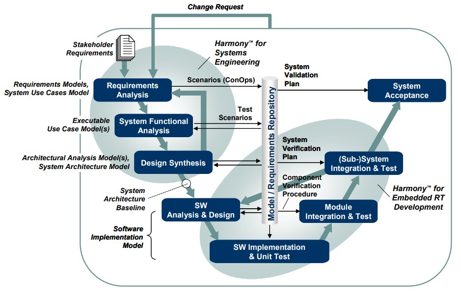
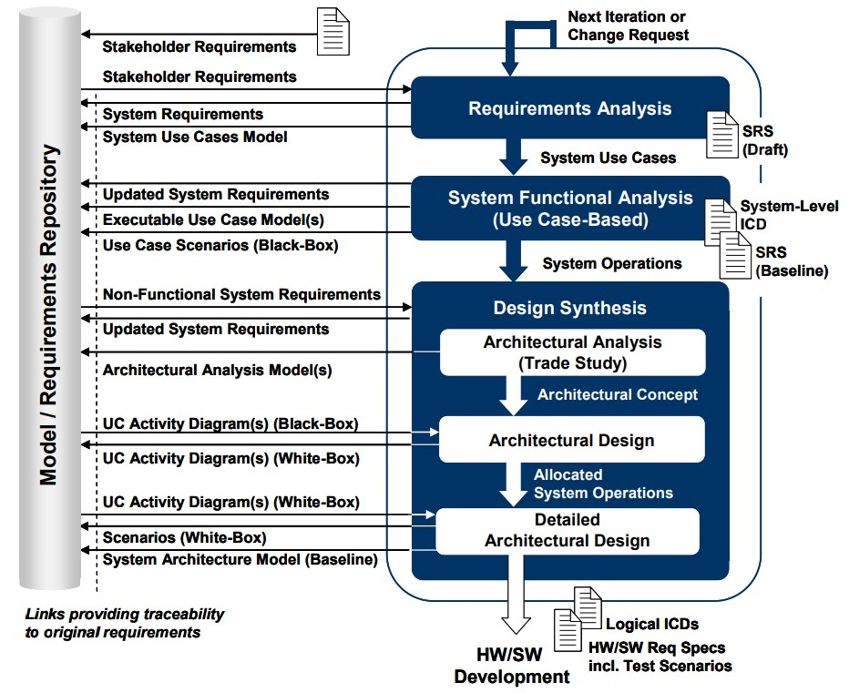
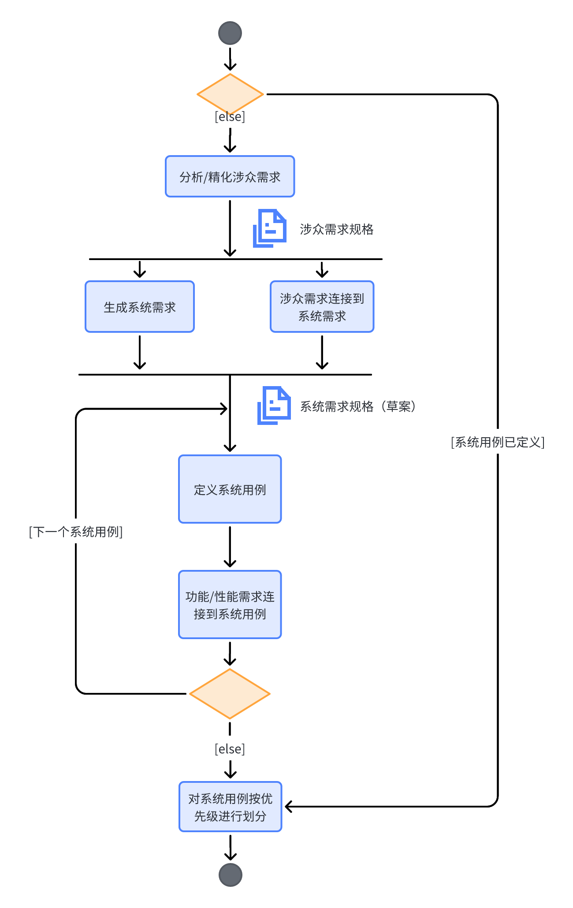

# Harmony SE

## Harmony SE 基础

### Rational 集成系统/嵌入式软件开发过程 *Harmony*

下图使用经典的V型图展示了Rational集成系统/嵌入式软件开发过程*Harmony*。 
V型的左边描述了自顶向下的设计流，而右边则展示了自底向上的集成阶段，包括单元测试到最终的系统验收。

当变更请求发生的时候，则整个过程从需求分析阶段重新开始。

*Harmony*过程包括两个紧密耦合的子过程：
  - ***Harmony系统工程***
  - ***Harmony实时嵌入式开发***

系统工程的工作流通过需求分析阶段、系统功能分析和设计综合进行增量式迭代。
增量是基于用例实现的。

软件工程的工作流通过软件分析和设计阶段、实现阶段，以及不同层级的集成和测试实现增量式迭代循环。

应该注意的是，不管是系统工程和实现迭代，分析迭代应该持续贯穿实现和测试，
以在每一个迭代中提供可展示的东西。

值得注意的是，需求相关的测试场景在整个自顶向下的设计路径中的创建和复用。
这些场景同样用于支撑自底向上的集成和测试阶段，以及在系统变更的情况下的回归测试循环。

*Harmony*过程支持*模型驱动开发*（MDD）。
在模型驱动开发中，模型是开发过程的*中心*产出，包括分析和设计。
每一个开发阶段都被特定类型的模型所支撑。

支撑*需求分析*阶段的模型是：
- *需求模型*
- *系统用例模型*

需求模型对需求层级进行了可视化。
系统用例模型将需求按*系统用例*进行分组。
这些模型都不是可执行的。

在系统功能分析阶段，重点是将功能需求转换为前后连贯一致的系统功能（*操作*）的说明。
每一个用例转换为一个可执行的模型，关联的系统需求则通过*模型执行*来验证。

支撑设计综合阶段的两种可执行模型为：
- 架构分析模型
- 系统架构模型

架构分析模型（也称为*权衡研究模型*）的目标是通过*参数分析*，来对指定的操作的实现进行详细的架构概念的描述。

系统架构模型将系统操作分配到前一个架构分析阶段中得到的系统架构上。
系统架构模型的正确性和完整性，通过模型执行来验证。
一旦模型得到验证，架构设计则可以开展性能和安全需求的分析。
这些分析可能包括*故障模式影响分析*（Failure Modes Effects Analysis, FMEA），以及*任务关键性分析*（Mission Criticality Analysis)。 

基线化的系统架构模型定义了接下来的硬件/软件开发的基础。

模型驱动的软件开发通过*软件实现模型*来支撑。
这个模型是代码生成的基础，代码生成可以是手动或自动的。

模型驱动开发过程的一个必要元素是*模型/需求仓库*。 
它包含待开发系统的由配置控制的知识，例如：
- 需求文档
- 需求追踪性
- 设计文档
- 测试定义

### 模型驱动的系统工程过程

*Harmony系统工程*的关键目标是：
- 识别并导出所需的系统功能
- 识别相关的系统模式和状态
- 将识别的系统功能和模式/状态分配到子系统结构上

对建模而言，这些目标意味着在高层抽象上的自顶向下的方法。
主要的重点在于所需的功能和基于状态的行为的识别和分配，
而不是功能行为的细节。

上图详细描述了基于模型的系统工程活动的流程和生成物，并且将相关的需求管理和追踪概念概括出来。

#### 需求分析

需求分析阶段的目标是分析整个过程的输入。
涉众需求被转换为系统需求，用于定义系统必须执行的行为（*功能需求*）
以及必须执行的多好（*服务质量需求*）。 

需求分析工作流的必要步骤如下图所示。
流程从涉众需求的分析以及可能的精化开始。
该阶段的输出是*涉众需求规格*。
涉众需求聚焦于所需的*能力*。
在下一步骤中，这些需求被转换为所需的系统功能，
记录在*草案系统需求规格*文档中。
为了维护追踪性，识别出的系统需求和相关的涉众需求关联起来。

接下来的一大步骤是系统用例定义。
用例描述了系统的一个特定的操作侧面。
其指定由*执行者*（用户）所感知到的行为，以及执行者和用例之间的消息流。
执行者可能是人，系统，或者是待开发系统（system under development, SuD)外部的一个硬件。
用例不会揭示或者暗示系统的内部结构（即用例属于黑盒视角）。

用例可以是具有层级结构的，但是需要注意不能按功能去分解用例。
用例不是功能，而是使用功能。
需要使用多少个用例来描述系统并没有“黄金法则”。
经验表明对于大型系统，在顶层一般会定义6~24个用例。
在最低的层级上，一个用例应该被至少5个，最多25个用例场景来描述。
在该阶段，重点放在识别“晴天”用例，即假定系统行为是没有错误和失败的。
异常场景将在稍后的阶段（系统功能分析），通过模型执行来识别。
如果对于一个用例，发现了超过5个错误或失败场景，那么这些场景应该归组为一个单独的*异常用例*，
该用例通过*包括*或*拓展*关系和晴天用例连接起来。

为了保证所有的功能以及相关的性能需求都被用例覆盖，需要建立相应的追踪连接。

系统级的用例定义完成，并且确保功能和相关性能需求的完整覆盖性之后，
需要根据其对所定义的系统架构定义的重要性进行排序。
用例的排序定义了迭代的系统工程工作流中的*增量*。
在每次迭代结束之后，排序可能需要更新。

#### 系统功能分析 

系统功能分析阶段的主要重点是将功能性的系统需求转变为系统功能（操作）的连贯描述。
该分析是基于用例的，即每一个在前一需求分析阶段识别出的系统级的用例，
都被转换为一个可执行的模型。
模型和相关的需求则通过模型执行来验证。

首先，用例模型的上下文定义在一张*内部模块图*中。
该图中的元素是SysML模块的实例，表示用例及其相关的执行者。
在此阶段，模块是空的，并没有和其他元素连接。

建模工作流的下一步是用例模块的行为定义。
通过三种SysML图表来捕获：
- *活动图*
- *序列图*
- *状态机图*

每种图表在详细描述用例行为中扮演特定的角色。
活动图（即用例黑盒活动图）描述了用例的整个功能流。
它将功能需求按*动作*分组，并展示这些动作/操作是如何互相连接的。
