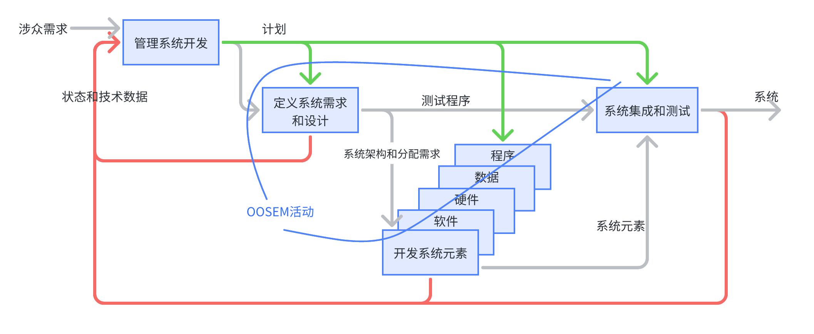

## 介绍

OOSEM（Object-Oriented Systems Engineering Method）是一种集成框架，将面向对象技术、基于模型的设计方法
以及传统的自顶向下的瀑布式SE实践结合起来。
OOSEM起初基于UML建模语言，之后在2006年根据SysML重新调整，现在被提倡为MBSE最佳实践之一。
OOSEM支持规格指定、分析、设计，以及验证。
OOSEM还可以促进和面向对象的软件开发、硬件开发以及验证和确认方法相集成。

面向对象的SE方法，
该方法论被应用在洛马公司一个分布式信息系统的开发中，
这个系统包括硬件、软件、数据库以及人工过程元素。

OOSEM的目标如下：
- 在整个生命周期中充分捕获信息，以支持系统的指定、分析、设计、验证和确认
- 将MBSE方法和面向对象的软件、硬件以及其他工程方法相集成
- 支持系统级的复用和设计演化

下图展示了组成OOSEM的技术和概念。

OOSEM将基础的SE实践、面向对象的概念以及其他独特的技术结合在一起，来处理系统复杂性。
SE中必要的做法是OOSMEM的核心原则，
包括需求分析、权衡研究以及集成产品和过程开发（Integrated Product and Process Development, IPPD)。
IPPD强调开发过程中的多学科团队合作。

OOSEM中所使用的面向对象的概念包括模块（即UML中类）和对象，
以及封装和继承的概念。
这些概念直接由SysML支持。
OOSEM所独有的技术包括参数分解、系统/逻辑分解、需求变体分析等等。

## 方法论概述

OOSEM支持如下图所示的开发过程。

开发过程包括以下子过程：
- *管理系统开发*: 管理和计划技术投入，包括计划、风险管理、配置管理，以及测量
- *定义系统需求和设计*：包括指定系统需求、开发系统架构，以及将系统需求分配到系统元素
- *开发系统元素*：设计、实现以及测试元素以满足分配的需求
- *集成和测试系统*：将系统元素进行集成，验证这些元素单独以及组合在一起的情况下是否满足系统需求

该过程和典型的V过程是一致的，其可以在系统架构的每一层级迭代循环进行。
例如，如果系统架构包含多个系统元素层级，该过程可以应用在系统层级上，来指定第一级的系统元素需求。
之后该过程可以再次对第一级中的每一个系统元素进行应用，以指定第二级系统元素的需求，如此重复。

OOSEM开发活动必须由系统工程师运用SE的基本原则来进行支持，包括多学科团队和严谨的管理流程的使用，
例如计划、风险管理、配置管理和测量。

系统需求和设计过程分解为以下OOSEM的高层级活动。

### 分析涉众需要

该活动支持as-is和to-be企业的分析。
在OOSEM中，企业将系统和其他外部系统聚合起来一起工作，来完成任务。
通过足够的细节捕获as-is'系统和企业，来理解其限制和所需的改进。
通过因果分析分析得到的as-is企业的限制，可以作为基础，来导出to-be企业的使命需求。

OOSEM对to-be企业制定了使命需求，以反映客户和其他利益相关者的需要。
使命需求包括新的和改进的能力的定义，以明确因果分析中识别出的限制。
to-be企业的能力通过带有相应MOE的用例来表示。
to-be企业作为已有系统或待开发系统的上下文。

支持分析（包括用例、场景分析、因果分析以及上下文图表）的建模制品可以在客户的as-is和to-be概念文档中捕获。

### 分析系统需求

### 定义逻辑架构

该活动包括将系统分解和划分为逻辑元素，例如，用户界面（由网络浏览器实现）或者环境监测器（由红外感应器实现）。
这些元素相互作用，以满足系统需求和系统功能。
逻辑架构/设计可以减少需求和技术变化对系统设计的影响。

OOSEM可以知道如何将系统分解为逻辑元素。
从逻辑场景中可以导出逻辑元素的功能，以支持系统黑盒系统功能。
逻辑元素的功能和数据可以基于其他准则（例如内聚、耦合、为变化进行设计、可靠性以及性能）进行再划分。

### 综合候选物理架构

### 优化评估可选方案

该活动贯穿在所有其他的OOSEM活动中，来对候选架构进行优化，
以及进行权衡研究，来选择合适的架构。
对性能、可靠性、可访问性、生命周期造价、人力以及其他专业的工程关注点建立的参数模型，用来分析和优化候选架构，以比较可选方案。
用于执行权衡研究的准则和权重因子，被关联到系统需求和MOE。
监测TPM，并识别潜在风险。

### 管理需求追踪性

TODO:

## 应用OOSEM

OOSEM是一种用来详细说明和设计系统的MBSE方法。
这些系统不仅包括运作的系统，例如飞船或者汽车，
也包括在运作的系统整个生命周期中对其使能的系统，
例如制造、支持以及验证系统。
该方法也可以用来构建体系或者企业，以及单个系统，甚至是系统元素。

OOSEM应该进行定制，以支持特定的应用、项目需要以及约束。
定制可能包括修改特定活动和相关建模制品，以及/或后续活动的重要程度，以适应具有特定生命周期的模型。

