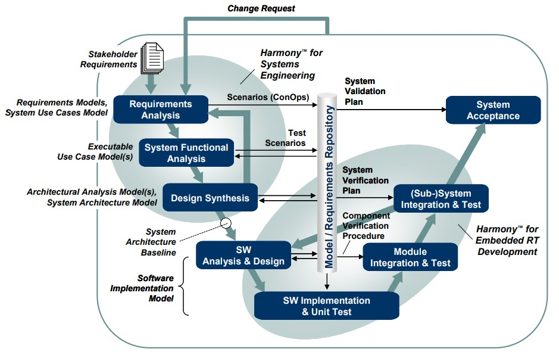
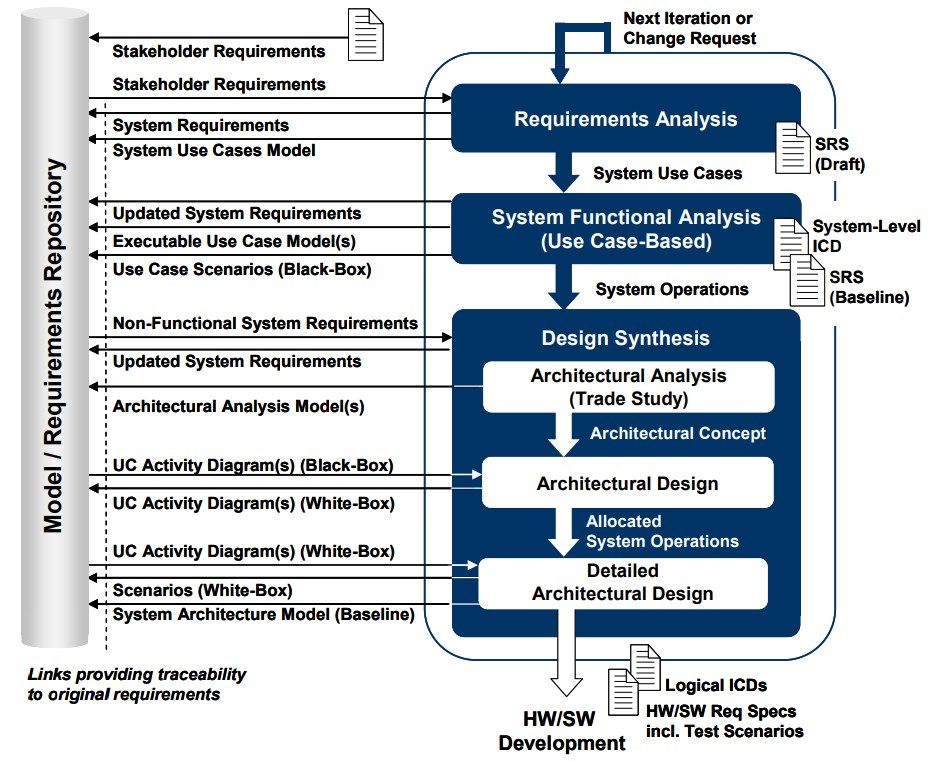
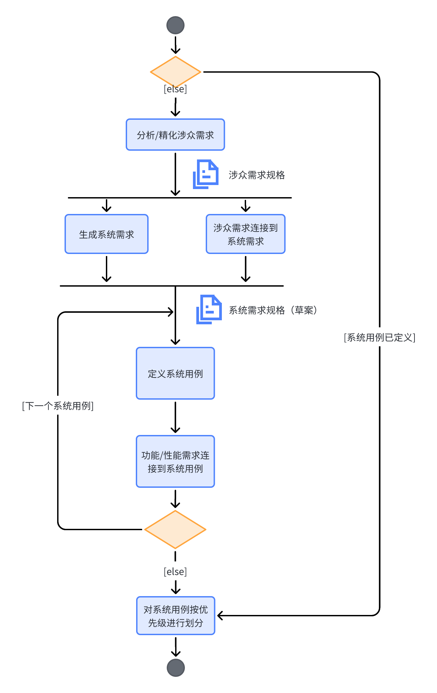

# Harmony SE

## Harmony SE 基础

### Rational 集成系统/嵌入式软件开发过程 *Harmony*

下图使用经典的V型图展示了Rational集成系统/嵌入式软件开发过程*Harmony*。 
V型的左边描述了自顶向下的设计流，而右边则展示了自底向上的集成阶段，包括单元测试到最终的系统验收。

当变更请求发生的时候，则整个过程从需求分析阶段重新开始。

*Harmony*过程包括两个紧密耦合的子过程：
  - ***Harmony系统工程***
  - ***Harmony实时嵌入式开发***

系统工程的工作流通过需求分析阶段、系统功能分析和设计综合进行增量式迭代。
增量是基于用例实现的。

软件工程的工作流通过软件分析和设计阶段、实现阶段，以及不同层级的集成和测试实现增量式迭代循环。

应该注意的是，不管是系统工程和实现迭代，分析迭代应该持续贯穿实现和测试，
以在每一个迭代中提供可展示的东西。

值得注意的是，需求相关的测试场景在整个自顶向下的设计路径中的创建和复用。
这些场景同样用于支撑自底向上的集成和测试阶段，以及在系统变更的情况下的回归测试循环。

*Harmony*过程支持*模型驱动开发*（MDD）。
在模型驱动开发中，模型是开发过程的*中心*产出，包括分析和设计。
每一个开发阶段都被特定类型的模型所支撑。

支撑*需求分析*阶段的模型是：
- *需求模型*
- *系统用例模型*

需求模型对需求层级进行了可视化。
系统用例模型将需求按*系统用例*进行分组。
这些模型都不是可执行的。

在系统功能分析阶段，重点是将功能需求转换为前后连贯一致的系统功能（*操作*）的说明。
每一个用例转换为一个可执行的模型，关联的系统需求则通过*模型执行*来验证。

支撑设计综合阶段的两种可执行模型为：
- 架构分析模型
- 系统架构模型

架构分析模型（也称为*权衡研究模型*）的目标是通过*参数分析*，来对指定的操作的实现进行详细的架构概念的描述。

系统架构模型将系统操作分配到前一个架构分析阶段中得到的系统架构上。
系统架构模型的正确性和完整性，通过模型执行来验证。
一旦模型得到验证，架构设计则可以开展性能和安全需求的分析。
这些分析可能包括*故障模式影响分析*（Failure Modes Effects Analysis, FMEA），以及*任务关键性分析*（Mission Criticality Analysis)。 

基线化的系统架构模型定义了接下来的硬件/软件开发的基础。

模型驱动的软件开发通过*软件实现模型*来支撑。
这个模型是代码生成的基础，代码生成可以是手动或自动的。

模型驱动开发过程的一个必要元素是*模型/需求仓库*。 
它包含待开发系统的由配置控制的知识，例如：
- 需求文档
- 需求追踪性
- 设计文档
- 测试定义

### 模型驱动的系统工程过程

*Harmony系统工程*的关键目标是：
- 识别并导出所需的系统功能
- 识别相关的系统模式和状态
- 将识别的系统功能和模式/状态分配到子系统结构上

对建模而言，这些目标意味着在高层抽象上的自顶向下的方法。
主要的重点在于所需的功能和基于状态的行为的识别和分配，
而不是功能行为的细节。

上图详细描述了基于模型的系统工程活动的流程和生成物，并且将相关的需求管理和追踪概念概括出来。

#### 需求分析

需求分析阶段的目标是分析整个过程的输入。
涉众需求被转换为系统需求，用于定义系统必须执行的行为（*功能需求*）
以及必须执行的多好（*服务质量需求*）。 

需求分析工作流的必要步骤如下图所示。
流程从涉众需求的分析以及可能的精化开始。
该阶段的输出是*涉众需求规格*。
涉众需求聚焦于所需的*能力*。
在下一步骤中，这些需求被转换为所需的系统功能，
记录在*草案系统需求规格*文档中。
为了维护追踪性，识别出的系统需求和相关的涉众需求关联起来。

接下来的一大步骤是系统用例定义。
用例描述了系统的一个特定的操作侧面。
其指定由*执行者*（用户）所感知到的行为，以及执行者和用例之间的消息流。
执行者可能是人，系统，或者是待开发系统（system under development, SuD)外部的一个硬件。
用例不会揭示或者暗示系统的内部结构（即用例属于黑盒视角）。

用例可以是具有层级结构的，但是需要注意不能按功能去分解用例。
用例不是功能，而是使用功能。
需要使用多少个用例来描述系统并没有“黄金法则”。
经验表明对于大型系统，在顶层一般会定义6~24个用例。
在最低的层级上，一个用例应该被至少5个，最多25个用例场景来描述。
在该阶段，重点放在识别“晴天”用例，即假定系统行为是没有错误和失败的。
异常场景将在稍后的阶段（系统功能分析），通过模型执行来识别。
如果对于一个用例，发现了超过5个错误或失败场景，那么这些场景应该归组为一个单独的*异常用例*，
该用例通过*包括*或*拓展*关系和晴天用例连接起来。

为了保证所有的功能以及相关的性能需求都被用例覆盖，需要建立相应的追踪连接。

系统级的用例定义完成，并且确保功能和相关性能需求的完整覆盖性之后，
需要根据其对所定义的系统架构定义的重要性进行排序。
用例的排序定义了迭代的系统工程工作流中的*增量*。
在每次迭代结束之后，排序可能需要更新。

#### 系统功能分析 

系统功能分析阶段的主要重点是将功能性的系统需求转变为系统功能（操作）的连贯描述。
该分析是基于用例的，即每一个在前一需求分析阶段识别出的系统级的用例，
都被转换为一个可执行的模型。
模型和相关的需求则通过模型执行来验证。

首先，用例模型的上下文定义在一张*内部模块图*中。
该图中的元素是SysML模块的实例，表示用例及其相关的执行者。
在此阶段，模块是空的，并没有和其他元素连接。

建模工作流的下一步是用例模块的行为定义。
通过三种SysML图表来捕获：
- *活动图*
- *序列图*
- *状态机图*

每种图表在详细描述用例行为中扮演特定的角色。
活动图（即用例黑盒活动图）描述了用例的整个功能流。
它将功能需求按*动作*分组，并展示这些动作/操作是如何互相连接的。
序列图（即用例黑盒序列图）描述了执行用例的某个特定的路径，定义了操作和执行者之间的交互（*消息*）。
状态机图从活动图（功能流）和序列图（执行者交互）中聚合信息，
将信息放到系统状态的上下文中，并将其添加到系统TODO:

这些图生成的顺序并没有强制的规定。
可以根据已有的信息以及建模人员的偏好来确定顺序。
三种可能的方式为：

**方式1**以*用例场景*的定义开始。
用户经常描述所需系统使用（例如，*操作概念*）的序列。
一旦捕获了一组必要的场景，所识别出的功能流就合并到活动图的
端口和接口从序列图中创建。
它们在用例模型内部模块图中定义了执行者和用例模块之间的连接。
这种方法的最后步骤是在状态机图中定义用例模块的基于状态的行为。

**方式2**以*用例功能流*的定义开始。
如果系统工程师必须详细描述需求，这是一种常见的方法。
一般地，用户喜欢在总体视角来表达它们的需求。
一旦整体的功能流得到定义，就可以从活动图中导出用例场景。
用例模块的端口和接口从序列图中创建。
最后，用状态机图捕获基于状态的行为。

**方式3**从*用例基于状态的行为*开始定义。
如果待设计系统（SuD）是明显基于状态的，那么推荐这种方式。
这种情况下，用例黑盒活动图的创建可以跳过。用例场景
之后端口和相关的接口从序列图中生成。

应该注意的是，不论采用那种方法，系统功能分析过程中作重要的图表是用例黑盒状态机图。
它同时包含黑盒序列图和用例黑盒活动图中的信息，也可以通过模型执行来验证。
用例黑盒活动图和相关的黑盒序列图在接下来的设计过程中将会被复用。

在基于用例的系统功能分析中，当识别出新的需求，或者高层级需求被派生需求细化的时候，
这些需求都应该记录下来。
在系统功能分析阶段的最后，这些额外的需求需要被利益相关者确认，
并导出到需求追溯工具中。

用例模型通过使用黑盒用例场景作为相应的触发的基础的模型执行来进行分析。
应该注意的是，根据前述的该过程的关键目标，
主要关注点应该是在生成的序列的验证上，而不是底层的功能的确认。

TODO: figs

一旦用例模型和其背后的功能需求得到验证，
就可以执行*雨天分析（rainy day analysis）*。
这种分析聚焦在系统错误/失败行为的识别，这些是在初始的需求集中没有被覆盖到的。

下图TODO:详细描述了雨天分析的工作流程，以及相关的工作产出。
建议先在状态机图中添加对应的异常行为，
因为这种图对整体系统行为描述的最好。
如果错误/失败行为包括新的功能，那么需要相应的更新用例黑盒活动图，
以及用例模型内部模块图（如果需要的话）。
扩展后的用例模型通过模型执行进行验证。
建议记录下各自的验证场景，将它们添加到用例黑盒序列图的集合中。

用例建模流程以用例模块属性和相关的系统需求之间的追踪连接的定义而结束。
如果建模过程中识别出了新的需求或者派生需求，
那么需要更新草案系统需求规格。

一旦一次迭代中所有的用例都被验证，有两种方式继续分析。
如果用例存在TODO:

如果不同的用例模型之间的一致性不存在问题，
那么识别出的操作、关联的服务请求，以及每个用例模型的属性被合并到一个共同的系统模块SuD中。
在接下来的设计阶段中，这些信息将被分配到子系统上。

系统功能分析阶段以基线化的*系统需求规格*结束。
该阶段生成的另一个文档是*系统级接口控制文档（System-Level Interface Control Document, ICD)*。
其定义了黑盒系统和执行者之间的逻辑（即功能）接口。
ICD是后续系统级测试定义的基础。

有时会出现这样的问题:是否应该构建一个黑盒功能系统模型(包括一个集成的黑盒状态图)，
以确保系统已被用例完全描述。
原则上，没有理由不这样做。
更实用和节省时间的方法是将这个问题转移到后续的设计综合阶段。
用例应该已经为启动架构设计带来了足够的系统信息。
缺失的东西，将在稍后通过模型执行验证系统架构模型时，得到确定。

#### 设计综合

*设计综合*的是焦点在于开发一个能够在固定的性能约束的极限内，执行所需的功能的物理架构（例如，一组产品、系统，以及软件元素）。
设计综合遵循自顶向下方法。
下图描述了必要的子阶段和相关的流程。

设计综合一般在架构分解的每一层级上以*架构分析*（也称为*权衡研究*）开始。
由于可能存在多个硬件和/或软件架构，能够满足给定的功能和性能需求，
因此，最优的设计概念基于一组条件（例如，*有效性度量*）进行推敲，这些条件根据相对重要性进行加权。

*架构设计*阶段的焦点在于将系统级的操作分配到架构结构的元素上。
该结构可能是由权衡研究得到的一个结果，也可能是一个给定的（传统）架构。
分配是一个迭代的过程，一般和领域专家一起完成。
考虑到需求分析阶段所捕获到的设计约束，例如性能和安全性需求等，会对不同的分配策略进行分析。

根据向后续的子系统开发所进行下发的要求，架构分析和架构设计阶段可能在架构分解的不同层级上重复进行。
在最低的层级上，功能分配可能会说明*实现*，即何种功能应该由硬件实现（例如，机械或FPGA/ASIC），而又有哪些功能应该由软件实现。

*详细架构设计*阶段的焦点在于在架构分解的最低级别上的系统模块定义端口、接口，以及基于状态的行为。

##### 架构分析（权衡研究）

系统功能分析定义了系统应该做*什么*，而不是*如何*做。
架构分析阶段*权衡研究*的目标是确定以合理的方式，达到某个特定功能的能力的最佳方法，即识别*如何*做。

一种确定*如何*的最简单的方法称为*加权目标法*，由N.Cross提出。
这种分析方法在工程系统设计领域广泛使用，用来评估功能问题的潜在方案。
该方法也可以用来确定软件的最优硬件平台，或者决定基于非功能需求（例如用户约束、性能或费用条件）而拆分的最优机械/电子硬件。

**识别关键系统功能**

该任务的目标是将系统功能分为更小的集合，以支持架构分析中的备选分析。
一个关键系统功能可能是这样的一组系统功能：
- 相互次序分明，并且/或者紧密耦合
- 由单一架构组件所实现
- 由复用现有的组件所实现
- 在系统内部复用
- 解决特定的设计约束

对每一个选择的关键系统功能，执行接下来的6个任务。

**定义候选方案**

实现一个关键系统功能，总是有多种方式。
该任务的目标是对识别出的关键系统功能，识别可能的方案。
这些方案由一个由所有相关领域专家组成的团队完成。
在这个阶段，相关的涉众需求需要识别出来并加以考虑。
候选方案可以是以前开发的硬件和软件组件、未开发的物品，以及商用现成（COTS）硬件和软件。

**识别评价准则**

**赋予评价准则权重**

**定义准则效用曲线**

该任务的目的是定义一组规范曲线-也称为*效用曲线*或者*价值函数*。
每个准则对应一条曲线，用于相乘，从而为每个候选方案得到一个无量纲的有效性度量。
该曲线通常产生一个在0~10之间的规范化的值。
曲线的输入通常是基于设备规格或者基于可能的方案计算推导得到。
这种情况下，曲线被认为是客观的。

效用曲线也可以由知识丰富的项目成员创建。
这种情况下，曲线反映团队内部的共识，但是应该被认为是主观的。

**赋予候选方案有效性度量**

**确定方案**

**合并可能的方案，形成系统架构**
对每一个关键系统功能识别出的方案进行合并，
以定义设备的分解结构。
假定初始的关键系统功能是相互独立的，这样，
最终合并的方案就是基于对完整架构的评价准则的一个首选方案。
该方案将作为后续架构设计活动的基准。
这些设计决策和其他得到的设计约束一起，在权衡研究报告中进行捕获。

##### 架构设计

##### 详细架构设计

#### 系统工程下发

在模型驱动开发中，从系统工程到后续的系统开发所下发的一个关键产物是基线化的可执行模型。
该模型是规格文档（例如硬件/软件需求规格、ICD）生成的来源仓库。
下发的范围和内容取决于系统工程所在的项目的特点以及组织的结构。

如果待开发系统是一个特定的软件配置项（Configuration Item， CI），
系统工程可能在系统功能分析层级上停止。
这种情况下，下发物为可执行的用例模型。

从组织视角来看，如果在系统工程和子系统工程之间存在隔离，
那么系统工程可能在系统架构分解的第一层停止。
这种情况下，下发物由相关的可执行子系统模型组成。

如果系统工程师将规格直接交给硬件/软件开发，
下发物为对应的可执行硬件和/或软件配置项模型。

任何情况下，下发物由以下内容组成：
- 基线化的可执行CI模型
- CI分配的操作定义，包括到相关的系统功能和性能需求的连接
- CI端口和逻辑接口的定义
- CI行为的定义，由状态机图捕获
- 测试场景，由系统级用例场景导出
- CI分配的非功能需求

应该注意的是，基线化的系统架构模型在后续的系统需求开发中，作为引用模型。

